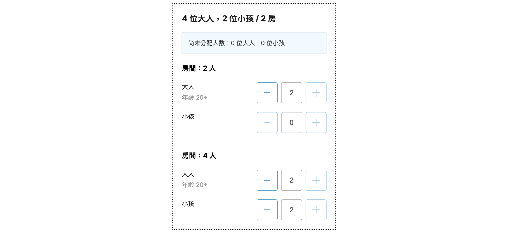

# Room Allocation

Room allocation interface built with Next.js 14, React 18, TypeScript, and styled-components, featuring dynamic allocation logic and unit tests.

**Tech Stack:** Next.js 14, React 18, TypeScript, styled-components, Jest



## Table of Contents

- [Introduction](#introduction)
- [Features](#features)
- [Installation](#installation)
- [Usage](#usage)
- [Components](#components)
- [Data Structure](#data-structure)
- [Customization](#customization)
- [License](#license)

## Introduction

Room Allocation is an interactive interface for dynamically distributing adults and children across available rooms based on guest counts, room capacity, and pricing constraints.

## Features

- Dynamic room allocation based on guest numbers and room capacity.
- Custom input components with increment and decrement functionality.
- Responsive design with styled-components.
- Easily customizable and extendable components.
- Support for keyboard input and mouse click for number inputs.
- Handles edge cases like maximum and minimum room capacities.

## Installation

To get started with this project, follow these steps:

1. **Clone the repository:**

   ```bash
   git clone https://github.com/LizzzYu/room-allocate.git
   cd room-allocation
   ```

2. **Install dependencies:**

   ```bash
   npm install
   ```

3. **Run the development server:**

   ```bash
   npm run dev
   ```

4. **Open your browser and visit:**

   ```bash
   http://localhost:3000
   ```

5. **Build the project:**

   ```bash
   npm run build
   ```

6. **Run the tests:**

   ```bash
   npm run test
   ```

## Usage

After running the development server, you can start using the application by adjusting the number of adults and children and selecting the rooms to see the dynamic room allocation.

## Components

1. **CustomInputNumber**  
   A reusable input component for handling numeric values with increment and decrement buttons.

2. **RoomAllocation**  
   Handles the main logic for room allocation based on the number of guests and available rooms.

3. **RoomAllocationCard**  
   Displays each room's allocation details, including the number of adults and children.

4. **RoomAllocationTag**  
   Shows the number of unallocated adults and children.

## Data Structure

The application uses a few key data structures:

- **Guest**: `{ adult: number, child: number }`
- **Room**: `{ roomPrice: number, adultPrice: number, childPrice: number, capacity: number }`
- **AllocatedRoom**: `{ adult: number, child: number, price: number }`

### Example Data

```javascript
const guest = { adult: 4, child: 2 };
const rooms = [
  { roomPrice: 1000, adultPrice: 200, childPrice: 100, capacity: 4 },
  { roomPrice: 0, adultPrice: 500, childPrice: 500, capacity: 4 },
  { roomPrice: 500, adultPrice: 300, childPrice: 200, capacity: 4 },
];
```

## Customization

The application is built with flexibility in mind. You can easily customize the colors, styles, and components by modifying the `colors.ts` and styled-components.

### Colors

All common colors are stored in the `src/app/styles/colors.ts` file for easy access and modification.

```typescript
export const colors = {
  textPrimary: '#4d4d4d',
  border: '#b3b3b3',
  backgroundPrimary: '#1b1b1b',
  textSecondary: '#999999',
  backgroundSecondary: '#f1faff',
  borderSecondary: '#d9e8ef',
  highlight: 'rgba(52, 162, 211, 0.6)',
  primary: '#34a2d3',
  textDark: '#1a1a1a',
  textLight: '#333333',
};
```

## License

This project is licensed under the MIT License. See the LICENSE file for more details.
